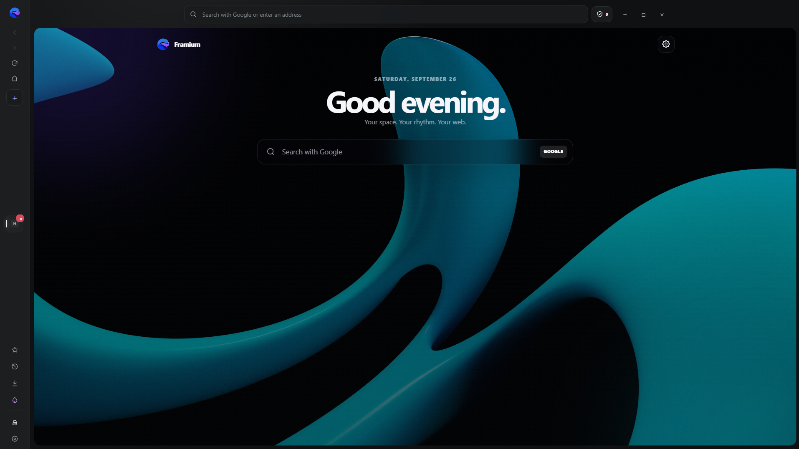
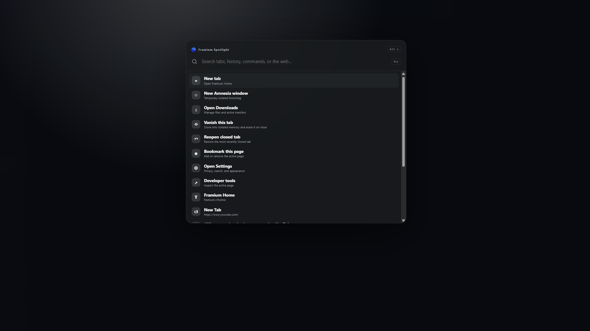

<div align="center">
  
  <h1>Framium</h1>
  <p><strong>A calmer, private, and deeply customizable Chromium browser.</strong></p>
  <p>
    <a href="https://github.com/ThePyDuck/Framium/releases/download/public/Framium.Setup.0.4.0.exe"><strong>Download for Windows</strong></a>
    ·
    <a href="https://github.com/ThePyDuck/Framium/releases">Releases</a>
    ·
    <a href="https://github.com/ThePyDuck/Framium/issues">Report an issue</a>
  </p>
</div>

---

Framium is an open-source desktop browser built around a clean vertical workspace, strong temporary-browsing tools, and a Home page that feels personal without becoming distracting. It uses Chromium through Electron and targets Windows and Linux.

## Preview

<table>
  <tr>
    <td align="center"><br><strong>Customizable Home</strong></td>
    <td align="center"><br><strong>Framium Spotlight</strong></td>
  </tr>
</table>

## Highlights

- **Vertical workspace** — organized tabs, compact mode, drag-to-reorder, pinned tabs, and a restrained browser frame.
- **Framium Spotlight** — press <kbd>Alt</kbd> + <kbd>L</kbd> to search tabs, bookmarks, history, browser commands, and the web.
- **Vanish Tabs** — isolated temporary tabs that erase their cookies, storage, cache, permissions, history, and download metadata when closed.
- **Amnesia windows** — private windows backed by isolated, non-persistent sessions.
- **A Home that is yours** — selectable atmospheres, custom background images, glass opacity, blur strength, draggable widgets, notes, quick links, and logo choices.
- **Focused fullscreen** — media fullscreen removes the sidebar, toolbar, margins, and rounded frame so only the content remains.
- **Useful downloads** — direct saving, optional save-location prompts, progress controls, open/show actions, and native file dragging.
- **Complete browser essentials** — bookmarks, history, permissions, printing, PDF export, find-in-page, DevTools, search-provider choices, and session restoration.
- **Privacy-conscious defaults** — site-scoped permission decisions, tracking-request blocking, secure renderer isolation, and no Node.js access for websites.

## Download

### Windows

[**Download Framium Setup 0.4.0**](https://github.com/ThePyDuck/Framium/releases/download/public/Framium.Setup.0.4.0.exe)

Additional packages can be published through [GitHub Releases](https://github.com/ThePyDuck/Framium/releases).

> Framium is an independent open-source project. Review release notes and verify that a download comes from this repository before installing it.

## Keyboard shortcuts

| Shortcut | Action |
| --- | --- |
| <kbd>Alt</kbd> + <kbd>L</kbd> | Open Framium Spotlight |
| <kbd>Ctrl</kbd> + <kbd>L</kbd> | Focus the address bar |
| <kbd>Ctrl</kbd> + <kbd>T</kbd> | Open a new tab |
| <kbd>Ctrl</kbd> + <kbd>W</kbd> | Close the active tab |
| <kbd>Ctrl</kbd> + <kbd>Shift</kbd> + <kbd>T</kbd> | Reopen the last closed tab |
| <kbd>Ctrl</kbd> + <kbd>D</kbd> | Add or remove a bookmark |
| <kbd>Ctrl</kbd> + <kbd>F</kbd> | Find on the current page |
| <kbd>Ctrl</kbd> + <kbd>J</kbd> | Open Downloads |
| <kbd>Ctrl</kbd> + <kbd>K</kbd> | Open Framium Spotlight |
| <kbd>F11</kbd> | Toggle window fullscreen |

## Privacy modes

### Vanish Tabs

A Vanish Tab lives in a temporary, isolated partition. Related child tabs share that temporary partition so a sign-in flow can work, while unrelated tabs remain separate. When the final related Vanish Tab closes, Framium clears its stored data and destroys the partition.

Vanish activity is excluded from normal history, bookmarks, recently closed tabs, persistent download records, and session restoration.

### Amnesia windows

An Amnesia window uses a unique non-persistent session. Cookies, cache, browsing records, permission choices, and temporary download metadata disappear when the window closes.

## Build from source

### Requirements

- Node.js **22.12.0 or newer**
- npm
- A supported Windows or Linux development environment

### Run locally

```bash
git clone https://github.com/ThePyDuck/Framium.git
cd Framium
npm ci
npm start
```

Development mode:

```bash
npm run dev
```

Validate JavaScript sources:

```bash
npm run check
```

### Package

Create an unpacked application for the current platform:

```bash
npm run pack
```

Create Linux packages:

```bash
npm run build:linux
```

Create Windows NSIS and portable packages on Windows:

```bash
npm run build:windows
```

Build output is written to `release/`.

## Project structure

```text
assets/             Application icons and Framium logo variants
src/main.js         Windows, tabs, sessions, permissions, and downloads
src/preload.js      Restricted browser-chrome IPC bridge
src/tab-preload.js  Restricted internal-page IPC bridge
src/ui/             Browser shell and settings interface
src/home/           Customizable Framium Home
src/downloads/      Internal download manager
index.html          Static Framium product website
```

## Contributing

Issues and focused pull requests are welcome. Before opening a pull request:

1. Keep website content sandboxed from browser internals.
2. Do not disable Chromium or Electron security boundaries to solve a feature problem.
3. Run `npm run check`.
4. Test changes in the packaged application, not only in development mode.
5. Keep the interface original, restrained, and accessible.

Use [GitHub Issues](https://github.com/ThePyDuck/Framium/issues) for reproducible bugs and feature proposals.

## License

Framium is available under the [BSD 3-Clause License](LICENSE).

Chromium and Electron are separate projects governed by their respective licenses and trademarks.
